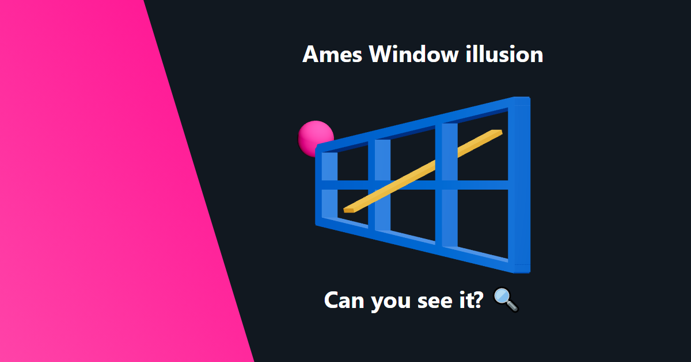

## Ames Window illusion: Can you see it?

Small web-app showing the Ames Window illusion with `@react-three/fiber`. 
Written for learning.

Access it on https://ames-window.vercel.app/

## Credits

### Tools used:

- [Next.js](https://nextjs.org/)
- [three.js](https://threejs.org/)
- [react-three-fiber](https://github.com/pmndrs/react-three-fiber)

For explanation about the illusion, check out this Veritasium's video:

